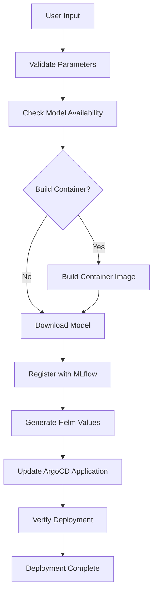

# Model Deployment Pipeline with Argo Workflows

This repository contains an automated pipeline for deploying machine learning models using Argo Workflows and ArgoCD. The pipeline handles model download from HuggingFace, MLflow registration, container building, and automated deployment to Kubernetes.

## Architecture Overview

The pipeline consists of the following components:

1. **Argo Workflows**: Orchestrates the entire deployment process
2. **ArgoCD**: Manages GitOps-based deployments to Kubernetes
3. **MLflow**: Tracks and registers model artifacts
4. **HuggingFace Hub**: Source for model downloads
5. **Helm Charts**: Templates for Kubernetes deployments

## Pipeline Workflow



## Prerequisites

1. **Kubernetes Cluster** with Argo Workflows and ArgoCD installed
2. **MLflow Server** running and accessible
3. **Container Registry** for storing built images
4. **GitHub Repository** with proper access tokens

## Installation

### 1. Install Argo Workflows

```bash
kubectl create namespace argo
kubectl apply -n argo -f https://github.com/argoproj/argo-workflows/releases/download/v3.5.4/install.yaml
```

### 2. Install Workflow Templates

```bash
kubectl apply -f workflows/advanced-model-deployment.yaml
```

### 3. Set up MLflow (Optional)

If you don't have MLflow running, you can install it:

```bash
kubectl create namespace mlflow
kubectl apply -f - <<EOF
apiVersion: apps/v1
kind: Deployment
metadata:
  name: mlflow-server
  namespace: mlflow
spec:
  replicas: 1
  selector:
    matchLabels:
      app: mlflow-server
  template:
    metadata:
      labels:
        app: mlflow-server
    spec:
      containers:
      - name: mlflow
        image: python:3.9-slim
        command: ["sh", "-c"]
        args:
        - |
          pip install mlflow
          mlflow server --host 0.0.0.0 --port 5000
        ports:
        - containerPort: 5000
---
apiVersion: v1
kind: Service
metadata:
  name: mlflow-server
  namespace: mlflow
spec:
  selector:
    app: mlflow-server
  ports:
  - port: 5000
    targetPort: 5000
EOF
```

## Usage

### Method 1: Using the Script

```bash
# Basic usage
./scripts/trigger-deployment.sh my-model BAAI/bge-small-en-v1.5

# With custom model type
./scripts/trigger-deployment.sh my-model microsoft/DialoGPT-medium trt

# With custom image and namespace
./scripts/trigger-deployment.sh my-model BAAI/bge-small-en-v1.5 default-vllm modelsync/vllm-server:latest production
```

### Method 2: Direct Workflow Creation

```bash
kubectl apply -f - <<EOF
apiVersion: argoproj.io/v1alpha1
kind: Workflow
metadata:
  name: deploy-my-model
  namespace: argo
spec:
  workflowTemplateRef:
    name: advanced-model-deployment-pipeline
  arguments:
    parameters:
    - name: model-name
      value: "my-model"
    - name: model-hf-path
      value: "BAAI/bge-small-en-v1.5"
    - name: model-type
      value: "default-vllm"
    - name: namespace
      value: "staging-models"
EOF
```

## Parameters

| Parameter | Description | Required | Default |
|-----------|-------------|----------|---------|
| `model-name` | Name of the model to deploy | Yes | - |
| `model-hf-path` | HuggingFace model path | Yes | - |
| `model-type` | Model type (default-vllm, trt, triton) | No | default-vllm |
| `image-name` | Container image name | No | Auto-generated |
| `namespace` | Target namespace | No | staging-models |
| `mlflow-tracking-uri` | MLflow server URI | No | http://mlflow-server:5000 |

## Model Types

### default-vllm
- Uses VLLM for high-performance inference
- Suitable for large language models
- Requires GPU resources

### trt
- Uses TensorRT for optimized inference
- Best for NVIDIA GPU deployments
- Requires TensorRT runtime

### triton
- Uses Triton Inference Server
- Supports multiple frameworks
- Production-ready serving

## Monitoring

### View Workflow Status

```bash
# List all workflows
kubectl get workflows -n argo

# Get specific workflow status
kubectl get workflow <workflow-name> -n argo

# Watch workflow progress
kubectl get workflow <workflow-name> -n argo -w
```

### View Logs

```bash
# View workflow logs
kubectl logs -f workflow/<workflow-name> -n argo

# View specific step logs
kubectl logs -f workflow/<workflow-name> -n argo -c <container-name>
```

### Argo Workflows UI

```bash
# Port forward to access UI
kubectl port-forward svc/argo-server -n argo 2746:2746

# Open browser to https://localhost:2746
```

## Troubleshooting

### Common Issues

1. **Model Download Fails**
   - Check HuggingFace model path
   - Verify network connectivity
   - Check disk space

2. **MLflow Registration Fails**
   - Verify MLflow server is running
   - Check MLflow tracking URI
   - Verify network connectivity

3. **ArgoCD Sync Fails**
   - Check repository access
   - Verify Helm chart structure
   - Check namespace permissions

4. **Container Build Fails**
   - Check Docker daemon
   - Verify base image availability
   - Check build context

### Debug Commands

```bash
# Check workflow events
kubectl describe workflow <workflow-name> -n argo

# Check pod logs
kubectl logs -f <pod-name> -n argo

# Check ArgoCD application status
kubectl get application <app-name> -n argocd

# Check deployment status
kubectl get deployment <deployment-name> -n <namespace>
```

## Customization

### Adding New Model Types

1. Update the workflow template to include new model type
2. Add appropriate container dependencies
3. Update resource requirements
4. Test with sample models

### Modifying Resource Requirements

Edit the `generate-values` step in the workflow template to adjust:
- CPU and memory requests/limits
- GPU requirements
- Storage requirements
- Network policies

### Custom Health Checks

Modify the health check endpoints in the application code and update the Helm values accordingly.

## Security Considerations

1. **Secrets Management**: Store sensitive data in Kubernetes secrets
2. **Network Policies**: Implement network segmentation
3. **RBAC**: Use proper role-based access control
4. **Image Security**: Scan container images for vulnerabilities
5. **Git Access**: Use service accounts with minimal permissions

## Contributing

1. Fork the repository
2. Create a feature branch
3. Make your changes
4. Test thoroughly
5. Submit a pull request

## License

This project is licensed under the MIT License - see the LICENSE file for details.
